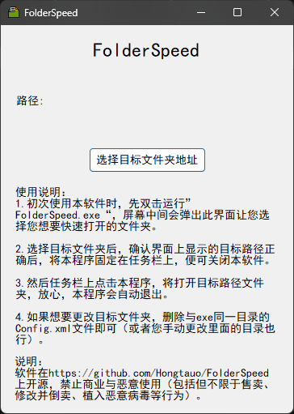

# FolderSpeed介绍

# 什么是FolderSpeed？

FolderSpeed是本人开发的一个用于在任务栏上快速打开自己设定好的目标文件夹的小工具，因为win11不支持在任务栏上固定常用文件夹，所以想开发个小工具方便自己日常使用

# 如何使用FolderSpeed

## 1. 下载程序

在https://github.com/Hongtauo/FolderSpeed/tree/main/FolderSpeed/bin/Release中找到FolderSpeed.exe或者在右侧Release中找到此文件，下载到本地

## 2. 运行

建议直接放在桌面，新建一个文件夹后把它丢进去，然后双击运行，初次运行会显示如下界面

​​

点击“选择目标文件夹地址”按钮，弹出选择界面，按照下方使用说明操作即可，关闭后路径自动生效

## 3.固定在任务栏

设置好第2点后，将exe本体拖拽到任务栏上即可，点击任务栏上该程序图标即可使用

​​

## 4.修改目标文件夹地址

找到第2点中的exe所在文件夹里面的“Config.xml”，删掉它直接重置程序（或者直接修改里面存储的地址也行）

​​

（修改<Path>xxxxxxx</Path>里面的地址）

# 声明

本程序在https://github.com/Hongtauo/FolderSpeed上公开，禁止商业与恶意使用，本程序的使用范围为：

* **个人或教育用途**：个人或教育用户可以在个人计算机上安装和使用本软件，用于学习、研究。
* **非商业组织**：非营利组织可以使用本软件进行日常操作和管理。
* **开源项目**：开源项目可以集成或使用本软件。
